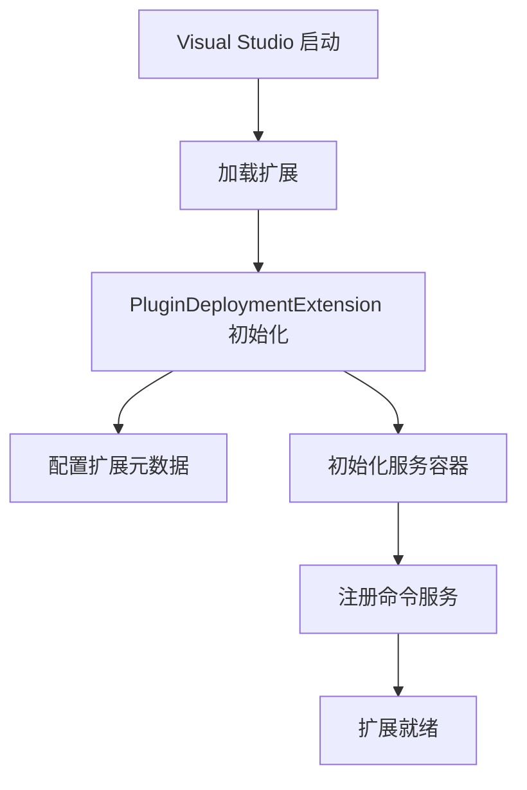
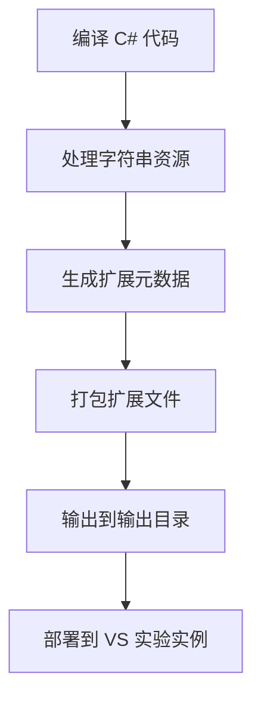

# PluginDeployment 项目结构和技术分析

## 项目概况 (Project Overview)

### 基本信息 (Basic Information)
- **项目类型**: Visual Studio 扩展 (Visual Studio Extension)
- **开发模式**: 新扩展性模型 (New Extensibility Model)
- **目标平台**: .NET 8.0 for Windows
- **主要功能**: 为 Visual Studio 项目右键菜单添加"插件发布"命令

### 技术栈分析 (Technology Stack Analysis)

#### .NET 版本详情 (.NET Version Details)
```xml
<TargetFrameworks>net8.0-windows8.0</TargetFrameworks>
```

**选择 .NET 8.0 的原因**:
1. **最新 LTS 版本**: 长期支持，稳定可靠
2. **性能优化**: 相比早期版本有显著性能提升
3. **新语言特性**: 支持 C# 12 的所有新特性
4. **Windows 专用**: `-windows` 后缀表示针对 Windows 平台优化

#### C# 语言特性 (C# Language Features)
```xml
<LangVersion>12</LangVersion>
<ImplicitUsings>enable</ImplicitUsings>
<Nullable>enable</Nullable>
```

**C# 12 新特性的应用**:
- **隐式 using**: 减少样板代码，提高开发效率
- **可空引用类型**: 编译时空引用检查，提高代码安全性
- **集合表达式**: 使用 `[...]` 语法初始化集合

## 项目架构深度分析 (Deep Architecture Analysis)

### 1. 扩展入口点 (Extension Entry Point)

**文件**: `PluginDeploymentExtension.cs`



**核心职责**:
1. **扩展标识**: 定义唯一的扩展 ID 和版本信息
2. **元数据配置**: 设置显示名称、描述、发布者信息
3. **服务注册**: 配置依赖注入容器
4. **生命周期管理**: 管理扩展的初始化和清理

### 2. 命令实现架构 (Command Implementation Architecture)

**文件**: `PluginDeployCommand.cs`

```mermaid
graph LR
    A[用户右键点击] --> B[VS 显示上下文菜单]
    B --> C[显示"插件发布"选项]
    C --> D[用户点击命令]
    D --> E[ExecuteCommandAsync 执行]
    E --> F[显示进度消息]
    F --> G[命令完成]
```

**关键技术实现**:

#### 菜单位置定位 (Menu Placement Targeting)
```csharp
CommandPlacement.VsctParent(
    new Guid("{d309f791-903f-11d0-9efc-00a0c911004f}"), 
    id: 518, 
    priority: 0)
```

**VSCT 系统详解**:
- **GUID**: Visual Studio Command Table 的标准组标识符
- **ID 映射表**:
  - `537`: 解决方案节点 (Solution Node)
  - `518`: 项目节点 (Project Node) ← **当前使用**
  - `521`: 项目文件 (Project Files)
  - `519`: 文件夹节点 (Folder Node)

#### 异步执行模式 (Asynchronous Execution Pattern)
```csharp
public override async Task ExecuteCommandAsync(
    IClientContext context, 
    CancellationToken cancellationToken)
```

**设计优势**:
1. **非阻塞**: 不会冻结 Visual Studio UI
2. **可取消**: 支持用户取消长时间运行的操作
3. **上下文感知**: 获取当前选中的项目/文件信息

### 3. 本地化系统 (Localization System)

**文件**: `.vsextension/string-resources.json`

```json
{
  "PluginDeployment.PluginDeployCommand.DisplayName": "插件发布",
  "PluginDeployment.PluginDeployCommand.ProgressMessage": "插件发布中"
}
```

**本地化机制**:
1. **键值映射**: 使用点分隔的命名空间结构
2. **动态加载**: VS 在运行时根据语言设置加载对应资源
3. **引用语法**: 代码中使用 `%key%` 语法引用

### 4. 配置管理 (Configuration Management)

**文件**: `ExtensionCommandConfiguration.cs`

**设计模式**: 静态配置类
- **当前状态**: 预留配置空间，实际配置在命令类中
- **扩展能力**: 可添加工具栏、快捷键、子菜单配置

## 依赖包分析 (Dependency Package Analysis)

### 核心 SDK 包 (Core SDK Packages)

#### Microsoft.VisualStudio.Extensibility.Sdk (17.14.40254)
**功能范围**:
- 扩展基础框架
- 命令系统
- UI 组件
- 异步操作支持

#### Microsoft.VisualStudio.Extensibility.Build (17.14.40254)
**功能范围**:
- 编译时工具
- 资源处理
- 元数据生成
- 部署打包

### 版本策略 (Versioning Strategy)
- **PrivateAssets="all"**: 依赖包不会传播到引用此项目的其他项目
- **版本同步**: 两个包版本保持一致，确保兼容性

## 构建和部署流程 (Build and Deployment Process)

### 构建过程 (Build Process)


### 部署机制 (Deployment Mechanism)
1. **开发时部署**: 自动部署到 Visual Studio 实验实例
2. **发布部署**: 生成 .vsix 文件进行分发
3. **调试支持**: F5 启动调试会自动重新部署

## 性能考虑 (Performance Considerations)

### 加载性能 (Loading Performance)
- **延迟加载**: 扩展只在需要时加载
- **最小化初始化**: 初始化过程尽可能轻量
- **服务注册**: 使用依赖注入避免不必要的对象创建

### 运行时性能 (Runtime Performance)
- **异步操作**: 所有 I/O 操作都是异步的
- **内存管理**: 合理使用 `CancellationToken` 避免内存泄漏
- **UI 响应性**: 长时间操作不阻塞 UI 线程

## 扩展性设计 (Extensibility Design)

### 水平扩展 (Horizontal Extension)
- **添加新命令**: 创建新的 Command 类
- **多菜单支持**: 配置多个 CommandPlacement
- **快捷键支持**: 添加键盘快捷键配置

### 垂直扩展 (Vertical Extension)
- **复杂业务逻辑**: 在 ExecuteCommandAsync 中实现
- **外部服务集成**: 通过依赖注入添加服务
- **状态管理**: 使用服务来管理扩展状态

## 调试和故障排除 (Debugging and Troubleshooting)

### 常用调试技巧 (Common Debugging Techniques)
1. **实验实例**: 使用 `/rootSuffix Exp` 启动独立实例
2. **日志记录**: 使用 Visual Studio 输出窗口查看日志
3. **断点调试**: 在扩展代码中设置断点

### 常见问题 (Common Issues)
1. **命令不显示**: 检查 CommandPlacement 配置
2. **本地化不生效**: 验证字符串资源文件格式
3. **扩展加载失败**: 检查扩展元数据和依赖项

## 最佳实践建议 (Best Practice Recommendations)

### 代码质量 (Code Quality)
1. **异步优先**: 所有可能阻塞的操作都使用异步
2. **错误处理**: 使用 try-catch 处理异常
3. **资源管理**: 正确实现 IDisposable

### 用户体验 (User Experience)
1. **响应式设计**: 提供即时反馈
2. **一致性**: 遵循 Visual Studio 的 UI 指南
3. **本地化**: 支持多语言用户

### 维护性 (Maintainability)
1. **清晰命名**: 使用描述性的类名和方法名
2. **文档完整**: 提供详细的代码注释
3. **模块化设计**: 保持类的单一职责

## 总结 (Summary)

PluginDeployment 项目展示了现代 Visual Studio 扩展开发的最佳实践：

1. **现代技术栈**: 使用 .NET 8.0 和 C# 12
2. **简洁架构**: 清晰的分层和职责分离
3. **用户友好**: 完整的中文本地化支持
4. **可维护性**: 详细的代码注释和文档
5. **扩展性**: 为未来功能扩展预留空间

这个项目为开发其他 Visual Studio 扩展提供了一个优秀的模板和参考。